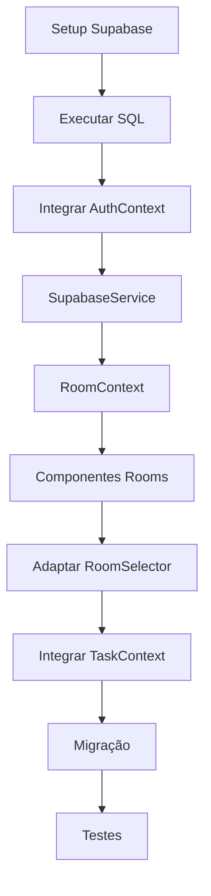

# 🚀 IMPLEMENTAÇÃO SUPABASE - TaskTracker Multi-Room

## 📋 VISÃO GERAL DO PROJETO

### Objetivos
- ✅ **Multi-tenancy**: Cada usuário pode criar múltiplas salas
- ✅ **Compartilhamento**: Acesso a salas de outros usuários via ID
- ✅ **Persistência**: Dados salvos no Supabase com RLS
- ✅ **Autenticação**: Login social (Google, GitHub) + email/senha
- ✅ **Real-time**: Colaboração em tempo real (opcional)

### Arquitetura Alvo
```
User (auth.users) → Rooms (user_rooms) → Tasks (tasks)
                 ↘ Room Access (room_access) ↗
```

---

## 🎯 ROADMAP DE IMPLEMENTAÇÃO

### **FASE 1: CONFIGURAÇÃO SUPABASE** (30 min)
#### 1.1 Criar Projeto Supabase
- [ ] Acessar [supabase.com](https://supabase.com)
- [ ] Criar novo projeto: `tasktracker-multi-room`
- [ ] Aguardar provisioning (2-3 min)
- [ ] Copiar `Project URL` e `anon public key`

#### 1.2 Configurar Autenticação
- [ ] Settings → Authentication → Providers
- [ ] Habilitar `Google OAuth` (opcional)
- [ ] Habilitar `GitHub OAuth` (opcional)
- [ ] Configurar `Email` (obrigatório)
- [ ] Site URL: `http://localhost:3000`

#### 1.3 Criar Estrutura de Tabelas
```sql
-- Execute no SQL Editor do Supabase
```

### **FASE 2: ESTRUTURA DE DADOS** (45 min)
#### 2.1 Tabela: rooms
```sql
CREATE TABLE rooms (
  id uuid PRIMARY KEY DEFAULT gen_random_uuid(),
  name text NOT NULL,
  description text,
  room_code text UNIQUE NOT NULL,
  owner_id uuid REFERENCES auth.users(id) ON DELETE CASCADE,
  is_public boolean DEFAULT false,
  created_at timestamp with time zone DEFAULT now(),
  updated_at timestamp with time zone DEFAULT now()
);

-- Index para performance
CREATE INDEX idx_rooms_owner ON rooms(owner_id);
CREATE INDEX idx_rooms_code ON rooms(room_code);
```

#### 2.2 Tabela: room_access
```sql
CREATE TABLE room_access (
  id uuid PRIMARY KEY DEFAULT gen_random_uuid(),
  room_id uuid REFERENCES rooms(id) ON DELETE CASCADE,
  user_id uuid REFERENCES auth.users(id) ON DELETE CASCADE,
  role text DEFAULT 'member' CHECK (role IN ('owner', 'admin', 'member', 'viewer')),
  granted_by uuid REFERENCES auth.users(id),
  created_at timestamp with time zone DEFAULT now(),
  
  UNIQUE(room_id, user_id)
);

-- Index para queries de acesso
CREATE INDEX idx_room_access_user ON room_access(user_id);
CREATE INDEX idx_room_access_room ON room_access(room_id);
```

#### 2.3 Tabela: tasks (adaptada)
```sql
CREATE TABLE tasks (
  id uuid PRIMARY KEY DEFAULT gen_random_uuid(),
  room_id uuid REFERENCES rooms(id) ON DELETE CASCADE,
  
  -- Campos TaskTracker existentes
  original_id integer,
  atividade text,
  user_story text,
  epico text,
  desenvolvedor text,
  sprint text,
  status text DEFAULT 'Backlog' CHECK (status IN ('Backlog', 'Priorizado', 'Doing', 'Done')),
  prioridade text DEFAULT 'Média' CHECK (prioridade IN ('Baixa', 'Média', 'Alta', 'Crítica')),
  
  -- Campos numéricos
  estimativa numeric DEFAULT 0,
  tempo_gasto numeric,
  taxa_erro numeric,
  
  -- Arrays e objetos
  reestimativas jsonb DEFAULT '[]',
  
  -- Campos opcionais
  detalhamento text,
  tipo_atividade text,
  tamanho_story text,
  tela text,
  observacoes text,
  motivo_erro text,
  
  -- Flags de controle
  tempo_gasto_validado boolean DEFAULT false,
  
  -- Auditoria
  created_by uuid REFERENCES auth.users(id),
  updated_by uuid REFERENCES auth.users(id),
  created_at timestamp with time zone DEFAULT now(),
  updated_at timestamp with time zone DEFAULT now()
);

-- Indexes para performance
CREATE INDEX idx_tasks_room ON tasks(room_id);
CREATE INDEX idx_tasks_status ON tasks(room_id, status);
CREATE INDEX idx_tasks_sprint ON tasks(room_id, sprint);
CREATE INDEX idx_tasks_dev ON tasks(room_id, desenvolvedor);
```

#### 2.4 Tabela: user_settings
```sql
CREATE TABLE user_settings (
  id uuid PRIMARY KEY DEFAULT gen_random_uuid(),
  user_id uuid REFERENCES auth.users(id) ON DELETE CASCADE,
  room_id uuid REFERENCES rooms(id) ON DELETE CASCADE,
  setting_key text NOT NULL,
  setting_value jsonb,
  updated_at timestamp with time zone DEFAULT now(),
  
  UNIQUE(user_id, room_id, setting_key)
);

-- Index para queries de configuração
CREATE INDEX idx_settings_user_room ON user_settings(user_id, room_id);
```

### **FASE 3: POLÍTICAS RLS** (30 min)
#### 3.1 Habilitar RLS
```sql
-- Habilitar Row Level Security
ALTER TABLE rooms ENABLE ROW LEVEL SECURITY;
ALTER TABLE room_access ENABLE ROW LEVEL SECURITY;
ALTER TABLE tasks ENABLE ROW LEVEL SECURITY;
ALTER TABLE user_settings ENABLE ROW LEVEL SECURITY;
```

#### 3.2 Políticas para rooms
```sql
-- Usuários podem ver salas que possuem ou têm acesso
CREATE POLICY "Users can view accessible rooms" ON rooms
  FOR SELECT
  USING (
    owner_id = auth.uid() OR
    is_public = true OR
    id IN (
      SELECT room_id FROM room_access 
      WHERE user_id = auth.uid()
    )
  );

-- Apenas donos podem criar/atualizar suas salas
CREATE POLICY "Users can manage their rooms" ON rooms
  FOR ALL
  USING (owner_id = auth.uid())
  WITH CHECK (owner_id = auth.uid());
```

#### 3.3 Políticas para room_access
```sql
-- Ver acessos das salas que tem permissão
CREATE POLICY "Users can view room access" ON room_access
  FOR SELECT
  USING (
    user_id = auth.uid() OR
    room_id IN (
      SELECT id FROM rooms WHERE owner_id = auth.uid()
    )
  );

-- Donos da sala podem gerenciar acessos
CREATE POLICY "Room owners can manage access" ON room_access
  FOR ALL
  USING (
    room_id IN (
      SELECT id FROM rooms WHERE owner_id = auth.uid()
    )
  );
```

#### 3.4 Políticas para tasks
```sql
-- Ver tasks das salas que tem acesso
CREATE POLICY "Users can view accessible tasks" ON tasks
  FOR SELECT
  USING (
    room_id IN (
      SELECT rooms.id FROM rooms
      LEFT JOIN room_access ON rooms.id = room_access.room_id
      WHERE rooms.owner_id = auth.uid() 
         OR room_access.user_id = auth.uid()
         OR rooms.is_public = true
    )
  );

-- Criar/editar tasks nas salas que tem acesso de membro+
CREATE POLICY "Users can manage tasks in accessible rooms" ON tasks
  FOR ALL
  USING (
    room_id IN (
      SELECT rooms.id FROM rooms
      LEFT JOIN room_access ON rooms.id = room_access.room_id
      WHERE rooms.owner_id = auth.uid() 
         OR (room_access.user_id = auth.uid() AND room_access.role IN ('admin', 'member'))
    )
  );
```

#### 3.5 Políticas para user_settings
```sql
-- Usuários podem gerenciar suas próprias configurações
CREATE POLICY "Users can manage their settings" ON user_settings
  FOR ALL
  USING (user_id = auth.uid())
  WITH CHECK (user_id = auth.uid());
```

### **FASE 4: FUNCTIONS E TRIGGERS** (20 min)
#### 4.1 Function: Gerar room_code único
```sql
CREATE OR REPLACE FUNCTION generate_room_code()
RETURNS text AS $$
DECLARE
  new_code text;
  exists_check boolean;
BEGIN
  LOOP
    new_code := upper(substring(md5(random()::text) from 1 for 8));
    SELECT EXISTS(SELECT 1 FROM rooms WHERE room_code = new_code) INTO exists_check;
    
    IF NOT exists_check THEN
      EXIT;
    END IF;
  END LOOP;
  
  RETURN new_code;
END;
$$ LANGUAGE plpgsql;
```

#### 4.2 Trigger: Auto room_code e room_access
```sql
-- Trigger para gerar room_code automaticamente
CREATE OR REPLACE FUNCTION set_room_defaults()
RETURNS TRIGGER AS $$
BEGIN
  -- Gerar room_code se não fornecido
  IF NEW.room_code IS NULL OR NEW.room_code = '' THEN
    NEW.room_code := generate_room_code();
  END IF;
  
  -- Set updated_at
  NEW.updated_at := now();
  
  RETURN NEW;
END;
$$ LANGUAGE plpgsql;

CREATE TRIGGER trigger_room_defaults
  BEFORE INSERT OR UPDATE ON rooms
  FOR EACH ROW
  EXECUTE FUNCTION set_room_defaults();

-- Trigger para adicionar dono à room_access automaticamente
CREATE OR REPLACE FUNCTION add_owner_access()
RETURNS TRIGGER AS $$
BEGIN
  INSERT INTO room_access (room_id, user_id, role, granted_by)
  VALUES (NEW.id, NEW.owner_id, 'owner', NEW.owner_id);
  
  RETURN NEW;
END;
$$ LANGUAGE plpgsql;

CREATE TRIGGER trigger_owner_access
  AFTER INSERT ON rooms
  FOR EACH ROW
  EXECUTE FUNCTION add_owner_access();
```

#### 4.3 Trigger: Updated_at automático
```sql
CREATE OR REPLACE FUNCTION update_updated_at()
RETURNS TRIGGER AS $$
BEGIN
  NEW.updated_at := now();
  RETURN NEW;
END;
$$ LANGUAGE plpgsql;

-- Aplicar a todas as tabelas
CREATE TRIGGER trigger_tasks_updated_at
  BEFORE UPDATE ON tasks
  FOR EACH ROW
  EXECUTE FUNCTION update_updated_at();

CREATE TRIGGER trigger_settings_updated_at
  BEFORE UPDATE ON user_settings
  FOR EACH ROW
  EXECUTE FUNCTION update_updated_at();
```

---

## 🔧 FASE 5: IMPLEMENTAÇÃO FRONTEND - DETALHADA

### **STATUS ATUAL** ✅
- [x] **Dependências instaladas**: @supabase/supabase-js@2.52.1
- [x] **Configuração**: .env.example atualizado
- [x] **AuthContext**: Implementado com Supabase Auth
- [x] **LoginModal**: Modal completo com email/password e OAuth
- [x] **AuthButton**: Botão de auth no header
- [x] **AuthGuard**: Proteção de rotas/componentes

### **PRÓXIMAS TAREFAS DETALHADAS**

#### **TAREFA 1: CONFIGURAR PROJETO SUPABASE** (15 min)
```bash
# O que fazer:
1. Acessar https://supabase.com
2. Criar projeto: tasktracker-multi-room
3. Aguardar provisioning (2-3 min)
4. Settings → API: copiar Project URL e anon key
5. Settings → Authentication → Providers:
   - Habilitar Email/Password ✓
   - Habilitar Google OAuth (opcional)
   - Site URL: http://localhost:3000
6. Criar arquivo .env.local com as chaves
```

#### **TAREFA 2: EXECUTAR SCRIPT SQL** (10 min)
```bash
# O que fazer:
1. No Supabase Dashboard → SQL Editor
2. Copiar conteúdo de /doc/supabase-setup.sql
3. Executar script completo
4. Verificar se retornou dados das queries de verificação
5. Confirmar tabelas criadas: rooms, room_access, tasks, user_settings
```

#### **TAREFA 3: INTEGRAR AUTHCONTEXT NO APP.JS** (20 min)
```javascript
// O que modificar em src/App.js:

// 1. Adicionar import AuthProvider (✅ já feito)
// 2. Detectar callback OAuth e renderizar AuthCallback
// 3. Envolver toda aplicação com AuthProvider
// 4. Remover botão Google antigo e usar AuthButton (✅ já feito)

// Código específico:
function App() {
  // Detectar callback OAuth
  if (window.location.pathname === '/auth/callback') {
    return <AuthCallback />;
  }

  return (
    <AuthProvider>        {/* ← Nova camada */}
      <TaskProvider>
        <FilterProvider>
          <UIProvider>
            <AppContent />
          </UIProvider>
        </FilterProvider>
      </TaskProvider>
    </AuthProvider>
  );
}
```

#### **TAREFA 4: IMPLEMENTAR SUPABASESERVICE.JS** (45 min)
```javascript
// Criar src/services/SupabaseService.js

import { DataService } from './DataService.js';
import { supabase } from '../config/supabase.js';

export class SupabaseService extends DataService {
  constructor(config = {}) {
    super(config);
    this.supabase = supabase;
    this.currentRoomId = config.roomId || null;
  }

  // IMPLEMENTAR TODOS OS MÉTODOS:
  
  // 1. Connection methods (15 min)
  async initialize() { }
  async disconnect() { }
  async healthCheck() { }

  // 2. Task CRUD (20 min)
  async getTasks(filters = {}) { }
  async getTask(id) { }
  async createTask(taskData) { }
  async updateTask(id, updates) { }
  async deleteTask(id) { }
  async bulkUpdateTasks(updates) { }
  async bulkDeleteTasks(ids) { }

  // 3. Query operations (10 min)
  async getTasksByStatus(status, filters = {}) { }
  async getTasksBySprint(sprint, filters = {}) { }
  async getTasksByDeveloper(developer, filters = {}) { }
  async getTasksByEpic(epic, filters = {}) { }
}
```

#### **TAREFA 5: CRIAR ROOMCONTEXT.JS** (30 min)
```javascript
// Criar src/contexts/RoomContext.js

export const RoomProvider = ({ children }) => {
  const [currentRoom, setCurrentRoom] = useState(null);
  const [userRooms, setUserRooms] = useState([]);
  const [loading, setLoading] = useState(false);

  // IMPLEMENTAR MÉTODOS:
  
  // 1. Room management (20 min)
  const createRoom = async (roomData) => { };
  const joinRoom = async (roomCode) => { };
  const leaveRoom = async (roomId) => { };
  const updateRoom = async (roomId, updates) => { };
  
  // 2. Access management (10 min)
  const inviteUser = async (roomId, email, role) => { };
  const removeUser = async (roomId, userId) => { };
  const changeUserRole = async (roomId, userId, newRole) => { };
};
```

#### **TAREFA 6: COMPONENTES DE ROOMS** (60 min)

##### **6.1 RoomCreator.js** (20 min)
```javascript
// Modal para criar nova sala
// Campos: name, description, is_public
// Gera room_code automaticamente
// Integra com RoomContext.createRoom()
```

##### **6.2 RoomJoiner.js** (15 min)
```javascript
// Modal para entrar em sala via código
// Campo: room_code
// Integra com RoomContext.joinRoom()
```

##### **6.3 RoomSettings.js** (25 min)
```javascript
// Modal de configurações da sala
// Seções:
// - Info básica (nome, descrição)
// - Membros e permissões  
// - Configurações WIP
// - Danger zone (excluir sala)
```

#### **TAREFA 7: ADAPTAR ROOMSELECTOR EXISTENTE** (25 min)
```javascript
// Modificar src/components/RoomSelector.js

// ANTES: Lista salas localStorage
// DEPOIS: Lista salas do usuário + opção join

const RoomSelector = ({ open, onRoomSelected }) => {
  const { userRooms, createRoom, joinRoom } = useRoom();
  const { isAuthenticated } = useAuth();

  // 1. Se não autenticado: mostrar salas locais (modo atual)
  // 2. Se autenticado: mostrar userRooms + botões criar/join
  // 3. Manter compatibilidade com código atual
};
```

#### **TAREFA 8: INTEGRAR SUPABASESERVICE NO TASKCONTEXT** (30 min)
```javascript
// Modificar src/contexts/TaskContext.js

export const TaskProvider = ({ children }) => {
  const { isAuthenticated, user } = useAuth();
  const { currentRoom } = useRoom();
  
  // Service selection based on auth state
  const getDataService = useCallback(() => {
    if (isAuthenticated && currentRoom) {
      return new SupabaseService({ roomId: currentRoom.id });
    }
    return new LocalStorageService();
  }, [isAuthenticated, currentRoom]);

  // Atualizar todos os métodos para usar o service correto
};
```

#### **TAREFA 9: FERRAMENTA DE MIGRAÇÃO** (40 min)
```javascript
// Criar src/utils/migration.js

export class MigrationService {
  
  // 1. Backup localStorage (10 min)
  static createBackup() { }
  
  // 2. Análise de dados (10 min)
  static analyzeMigration() { }
  
  // 3. Migração para Supabase (15 min)
  static migrateToSupabase(roomName) { }
  
  // 4. Rollback em caso de erro (5 min)
  static rollback() { }
}

// Criar componente MigrationWizard.js (modal)
```

#### **TAREFA 10: TESTES DE INTEGRAÇÃO** (30 min)
```javascript
// 1. Testar auth flow completo (10 min)
// - Login/logout
// - OAuth providers
// - Session persistence

// 2. Testar room management (10 min)
// - Criar sala
// - Join via código
// - Gerenciar membros

// 3. Testar CRUD de tasks (10 min)
// - Criar task em sala
// - Compartilhar entre usuários
// - Permissões corretas
```

### **ORDEM DE EXECUÇÃO OTIMIZADA**



### **CHECKLIST DE VALIDAÇÃO**

#### **Milestone 1: Auth Working** ✅
- [x] Login/logout funcional
- [x] OAuth providers working
- [x] Session persistence
- [x] AuthButton no header

#### **Milestone 2: Database Ready**
- [ ] Projeto Supabase criado
- [ ] SQL script executado
- [ ] RLS policies testadas
- [ ] Tabelas populadas

#### **Milestone 3: Room System**
- [ ] RoomContext implementado
- [ ] Criar sala funcional
- [ ] Join sala via código
- [ ] Gerenciar membros

#### **Milestone 4: Task Integration**
- [ ] SupabaseService completo
- [ ] TaskContext usando service correto
- [ ] CRUD tasks em salas compartilhadas
- [ ] Migração localStorage → Supabase

#### **Milestone 5: Production Ready**
- [ ] Todos os testes passando
- [ ] Error handling robusto
- [ ] Performance otimizada
- [ ] Documentação atualizada

### **ESTIMATIVAS DE TEMPO**

| Tarefa | Tempo | Dependências |
|--------|-------|--------------|
| 1. Setup Supabase | 15min | - |
| 2. SQL Script | 10min | Tarefa 1 |
| 3. AuthContext App.js | 20min | - |
| 4. SupabaseService | 45min | Tarefa 2 |
| 5. RoomContext | 30min | Tarefa 4 |
| 6. Componentes Rooms | 60min | Tarefa 5 |
| 7. RoomSelector | 25min | Tarefa 6 |
| 8. TaskContext Integration | 30min | Tarefa 7 |
| 9. Migração | 40min | Tarefa 8 |
| 10. Testes | 30min | Todas |
| **TOTAL** | **~5h** | - |

### **ARQUIVOS A SEREM CRIADOS/MODIFICADOS**

#### **Novos Arquivos** (9 arquivos)
- ✅ `src/config/supabase.js` 
- ✅ `src/contexts/AuthContext.js`
- ✅ `src/components/auth/AuthButton.js`
- ✅ `src/components/auth/LoginModal.js` 
- ✅ `src/components/auth/AuthGuard.js`
- ✅ `src/components/auth/AuthCallback.js`
- [ ] `src/services/SupabaseService.js`
- [ ] `src/contexts/RoomContext.js`
- [ ] `src/components/rooms/RoomCreator.js`
- [ ] `src/components/rooms/RoomJoiner.js`
- [ ] `src/components/rooms/RoomSettings.js`
- [ ] `src/utils/migration.js`
- [ ] `src/components/MigrationWizard.js`

#### **Arquivos Modificados** (4 arquivos)
- [ ] `src/App.js` - Integrar AuthProvider e callback
- [ ] `src/contexts/TaskContext.js` - Service switching
- [ ] `src/components/RoomSelector.js` - Adaptar para Supabase
- [x] `.env.example` - Adicionar Supabase config

### **PONTOS DE ATENÇÃO**

1. **Compatibilidade**: Manter localStorage funcionando
2. **Migração**: Backup obrigatório antes de migrar
3. **Permissões**: Testar RLS policies cuidadosamente
4. **Performance**: Otimizar queries com índices
5. **UX**: Feedback visual para todas operações async
6. **Error Handling**: Tratamento robusto de erros de rede

---

**🎯 STATUS: ROADMAP COMPLETO E DETALHADO - PRONTO PARA EXECUÇÃO INCREMENTAL**

---

## 📊 MÉTRICAS DE SUCESSO

### Funcionalidades Core
- [ ] ✅ Autenticação funcional (login/logout)
- [ ] ✅ Criação de salas com room_code único
- [ ] ✅ Listagem de salas do usuário
- [ ] ✅ Acesso a sala via room_code
- [ ] ✅ CRUD de tasks por sala
- [ ] ✅ Permissões de acesso (owner/member/viewer)
- [ ] ✅ Migração dados localStorage → Supabase

### Performance
- [ ] ✅ Queries otimizadas (< 200ms)
- [ ] ✅ RLS funcionando corretamente
- [ ] ✅ Indices apropriados criados
- [ ] ✅ Bundle size aceitável (< 500kb)

### UX
- [ ] ✅ Transição suave localStorage → Supabase
- [ ] ✅ Feedback visual para operações async
- [ ] ✅ Tratamento de erros robusto
- [ ] ✅ Modo offline (fallback localStorage)

---

## 🚨 RISCOS E MITIGAÇÕES

### Risco 1: Complexidade de RLS
**Mitigação**: Testar políticas isoladamente no SQL Editor

### Risco 2: Performance com muitas salas
**Mitigação**: Paginação + indices + cache local

### Risco 3: Migração de dados
**Mitigação**: Backup localStorage + migração incremental

### Risco 4: Context explosion
**Mitigação**: Composers + hooks granulares

---

## 🎯 TIMELINE ESTIMADO

| Fase | Tempo | Descrição |
|------|-------|-----------|
| 1-4 | 2h | Setup Supabase + Estrutura DB |  
| 5.1-5.2 | 15min | Instalação + Config |
| 5.3 | 1h | SupabaseService.js |
| 5.4 | 2h | AuthContext + componentes |
| 5.5 | 1.5h | RoomContext + componentes |
| 5.6 | 1h | Integração TaskContext |
| 5.7 | 1h | Migração + testes |
| **Total** | **~8-9h** | **Implementação completa** |

---

## 📋 PRÓXIMOS PASSOS

### IMEDIATO
1. [ ] **Configurar projeto Supabase** (Fase 1)
2. [ ] **Executar scripts SQL** (Fases 2-4)  
3. [ ] **Implementar SupabaseService** (Fase 5.3)
4. [ ] **Criar AuthContext** (Fase 5.4)

### APÓS CORE
- [ ] Real-time subscriptions (Supabase Realtime)
- [ ] Push notifications
- [ ] Audit log de mudanças
- [ ] Analytics de uso por sala

---

**🚀 PRONTO PARA COMEÇAR A IMPLEMENTAÇÃO!**

*Este documento será atualizado conforme progresso da implementação*